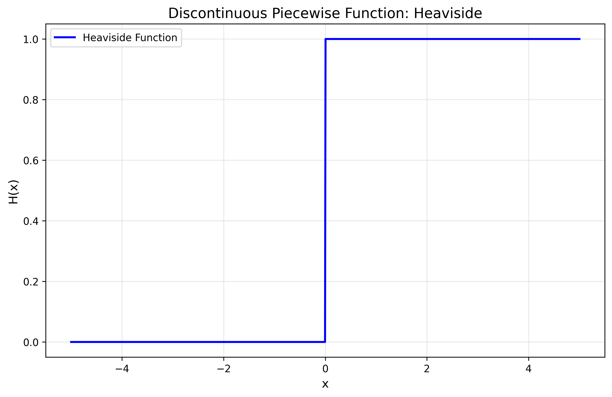
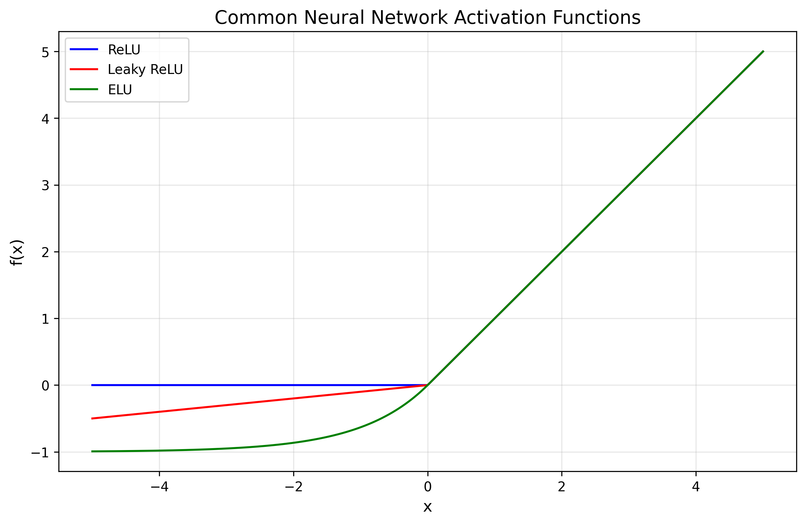
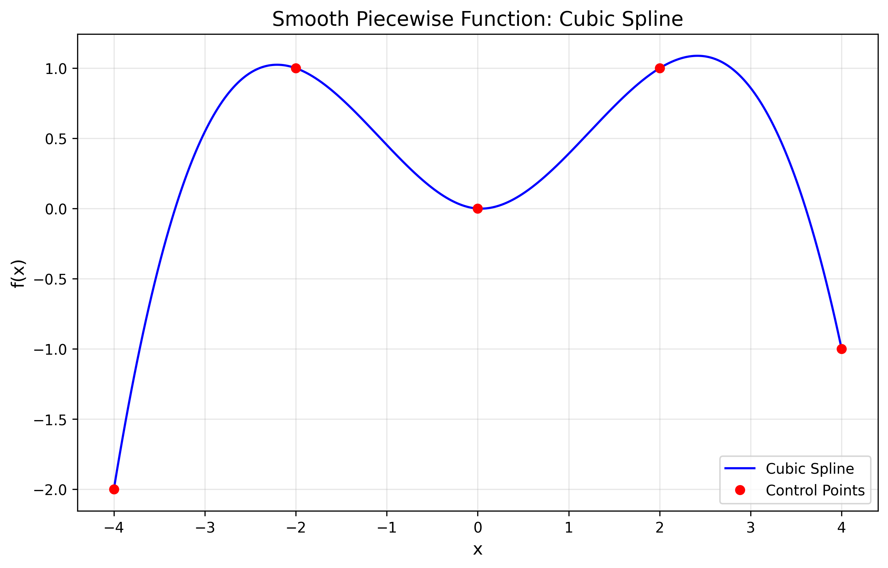
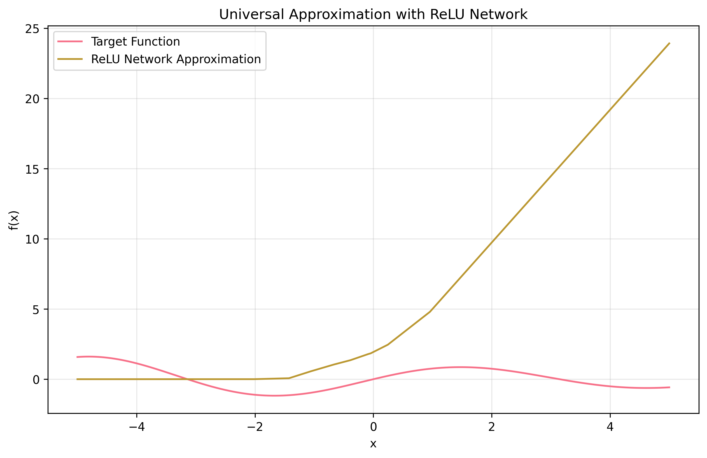

<script type="text/javascript" async
  src="https://cdnjs.cloudflare.com/ajax/libs/mathjax/2.7.7/MathJax.js?config=TeX-AMS_HTML">
</script>


# Piecewise Functions: The Hidden Framework of Modern Deep Learning

## Introduction: The Power of Breaking Things Apart

Have you ever wondered why neural networks can approximate any continuous function? Or why modern deep learning works so well in practice? The answer lies in a fundamental mathematical concept: piecewise functions.

The name "Piecewise" represents more than just a mathematical construct—it embodies a powerful principle in science and engineering: complex problems can be solved by breaking them into simpler, manageable pieces.

## Mathematical Foundations

### What Makes a Function Piecewise?

A piecewise function is formally defined as:

$$
f(x) = \begin{cases} 
f_1(x) & \text{if } x \in I_1 \\ 
f_2(x) & \text{if } x \in I_2 \\ 
\vdots \\ 
f_n(x) & \text{if } x \in I_n 
\end{cases}
$$


where \(\{I_1, I_2, \dots, I_n\}\) forms a partition of the domain. Each \(I_k\) is called a "piece" of the domain, and \(f_k\) is the function defined on that piece.

### The Beauty of Discontinuity

Not all piecewise functions are created equal. Let's explore three levels of regularity:

1. **Discontinuous Piecewise Functions**
   - Classic example: The Heaviside function
     
    $$
    H(x) = \begin{cases} 
    0 & \text{if } x < 0 \\ 
    1 & \text{if } x \geq 0 
    \end{cases}
    $$

    
    *Figure 1: The Heaviside function demonstrating discontinuous behavior at x = 0*
   
   - Applications: 
     - Digital signal processing (step responses)
     - Quantum mechanics (potential wells)
     - Control systems (bang-bang control)

2. **Continuous Piecewise Functions**
   - The famous ReLU function:
     
     $$
     \text{ReLU}(x) = \max(0, x) = \begin{cases}
     0 & \text{if } x < 0 \\ 
     x & \text{if } x \geq 0 
     \end{cases}
     $$
   
    *Figure 2: Common neural network activation functions*
   
  - Properties:
    - Continuous everywhere
    - Not differentiable at \( x = 0 \)
    - Linear behavior in the positive regime

3. **Smooth Piecewise Functions**
   - Cubic splines with mathematical form:
     
     $$
     S_i(x) = a_i(x - x_i)^3 + b_i(x - x_i)^2 + c_i(x - x_i) + d_i
     $$

    
*Figure 4: A cubic spline showing smooth piecewise behavior*
   
  - Properties:
    - Continuous up to the second derivative
    - Natural interpolation
    - Minimal curvature property

## The Deep Learning Connection

### ReLU: The Building Block of Modern Neural Networks

The Rectified Linear Unit (ReLU) is perhaps the most important piecewise function in modern machine learning. Its simplicity belies its power:

```python
import numpy as np
def relu(x):
    return np.maximum(0, x)

# Vectorized implementation
def relu_vectorized(X):
    return np.maximum(0, X)
```
## What Makes ReLU Special? Let's Analyze its Properties

### Sparsity

Mathematical representation:

$$
\text{Sparsity}(x) = P(x \leq 0)
$$

- Creates naturally sparse representations
- Helps in feature selection

### Non-Saturation

Gradient behavior:

$$
\frac{\partial \text{ReLU}(x)}{\partial x} = 
\begin{cases} 
1 & \text{if } x > 0 \\ 
0 & \text{if } x < 0 
\end{cases}
$$

- No vanishing gradient for positive inputs

### Universal Approximation: The Theory

The Universal Approximation Theorem makes a profound statement about neural networks with piecewise activation functions. For any continuous function \( f: [a, b] \rightarrow \mathbb{R} \) and \( \epsilon > 0 \), there exists a neural network \( N \) with ReLU activations such that:

$$
\sup_{x \in [a, b]} |f(x) - N(x)| < \epsilon
$$


*Figure 3: Example of universal approximation using ReLU networks*

This is achieved through:

1. **Local Linear Approximation**

   Each ReLU unit contributes a "hinge":

   $$
   h_i(x) = \max(0, w_i x + b_i)
   $$

2. **Composition of Pieces**

   Network output:

   $$
   N(x) = \sum_{i=1}^n v_i \max(0, w_i x + b_i)
   $$

## Practical Applications

Let's implement some key concepts in Python:

```python
import numpy as np
import matplotlib.pyplot as plt

# Different activation functions
def relu(x): 
    return np.maximum(0, x)

def leaky_relu(x, alpha=0.01): 
    return np.where(x > 0, x, alpha * x)

def elu(x, alpha=1.0): 
    return np.where(x > 0, x, alpha * (np.exp(x) - 1))

# Visualization
x = np.linspace(-5, 5, 1000)
functions = {
    'ReLU': relu(x),
    'Leaky ReLU': leaky_relu(x),
    'ELU': elu(x)
}

plt.figure(figsize=(12, 6))
for name, f in functions.items():
    plt.plot(x, f, label=name)
plt.grid(True)
plt.legend()
plt.title('Common Neural Network Activation Functions')
plt.xlabel('x')
plt.ylabel('f(x)')
plt.show()
```

## Future Directions

The story of piecewise functions continues to evolve:

- **Theoretical Developments**
  - New activation function designs
  - Improved approximation theorems
  - Connections to geometric deep learning

- **Practical Applications**
  - Hardware-efficient implementations
  - Sparse computation methods
  - Automated architecture design

## Conclusion

The principle of piecewise decomposition extends beyond mathematics—it's a fundamental way of understanding complexity. By breaking down complex problems into simpler, manageable pieces, we can:

- Build intuitive understanding
- Develop efficient algorithms
- Create scalable solutions

This is why I chose "Piecewise" as my portfolio name. It represents not just a mathematical concept, but a philosophy: complex problems become manageable when broken into pieces, just as complex functions become understandable through their piecewise representations.

## References

- Glorot, X., et al. (2011). "Deep Sparse Rectifier Neural Networks"
- He, K., et al. (2015). "Delving Deep into Rectifiers"
- Cybenko, G. (1989). "Approximation by Superpositions of a Sigmoidal Function"
- Hornik, K. (1991). "Approximation Capabilities of Multilayer Feedforward Networks"

> **Note**: This post assumes basic familiarity with calculus and neural networks. For a gentler introduction to these concepts, see my upcoming post on mathematical foundations of deep learning.

